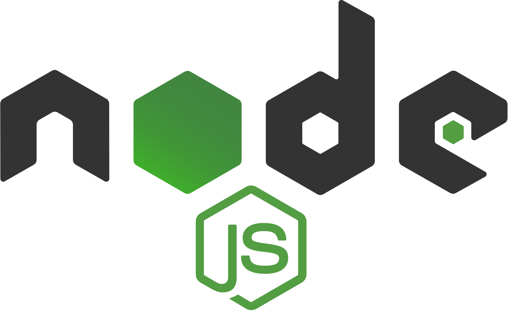

<h1>E-commerce App</h1>

E-commerce website where you can find and purchase yummy snacks.

#

## Table of Contents

[](#)

- [](#)
  - [Table of Contents](#table-of-contents)
  - [Prerequisites](#prerequisites)
- [](#-1)
  - [Tech Stack](#tech-stack)
- [](#-2)
  - [Getting Started](#getting-started)
- [](#-3)
  - [Project Structure](#project-structure)

## Prerequisites

-  <p>_Node JS @12.X and up_</p>
-  <p>_npm @6 and up_</p>

#

## Tech Stack

-  <p><a href="https://www.typescriptlang.org/" target="_blank">[React @18.2.0]</a> - The library for web and native user interfaces<p/>

-  <p><a href="https://www.typescriptlang.org/" target="_blank">[Redux Toolkit @1.8.5]</a> - The official, opinionated, batteries-included toolset for efficient Redux development<p/>

#

## Getting Started

1\. First of all you need to clone repository from github:

```sh
git clone https://github.com/Ana-Vartasashvili/ecommerce-app.git
```

2\. Navigate to the repository

```sh
cd ecommerce-app/
```

3\. Next step requires install all the dependencies

```sh
npm install
```

or

```sh
yarn install
```

4\. after that you can run application from terminal:

```sh
npm run dev
```

Runs the app in the development mode. Open http://localhost:3000 to view it in your browser.

#

## Project Structure

```bash

├─── public
├─── readme
│     └── assets
├─── src
│     ├── components
│     │    ├── componentFolder
│     │    │    ├── Component.js
│     │    │    └── Component.module.css
│     │    ├── icons
│     │    └── images
│     ├── pages
│     │    └── pageFolder
│     │        ├── Page.js
│     │        └── Page.module.css
│     ├── store
│     ├── UI
│     ├── App.js
│     ├── index.css
│     └── index.js
│- .gitignore
│- .prettierrc.json
│- package-lock.json
│- package.json
│- README.md


```
